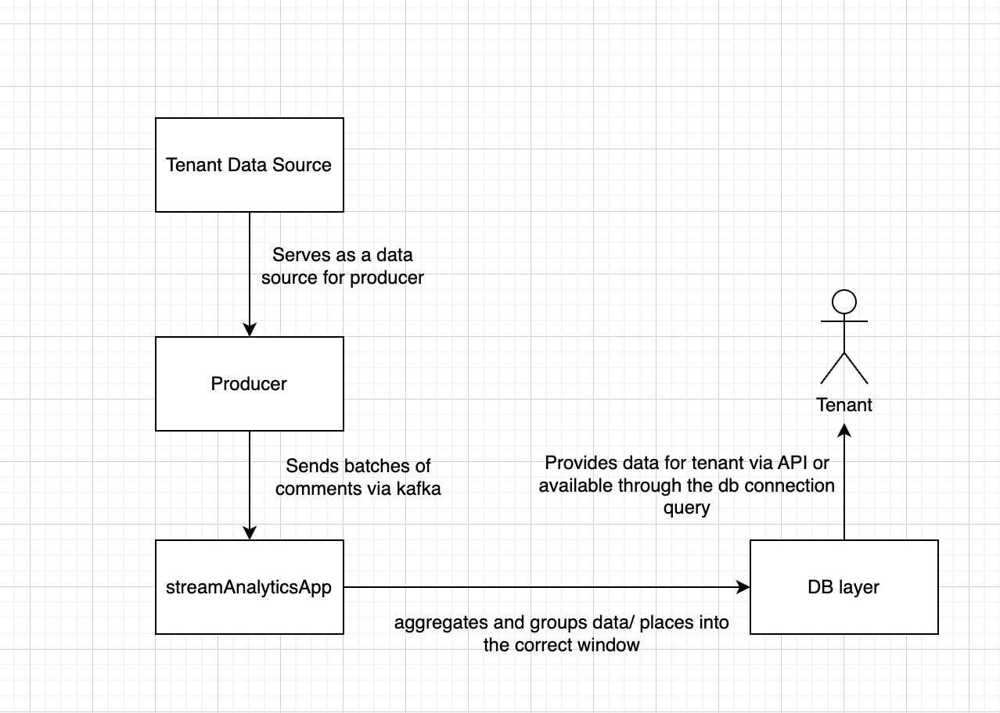
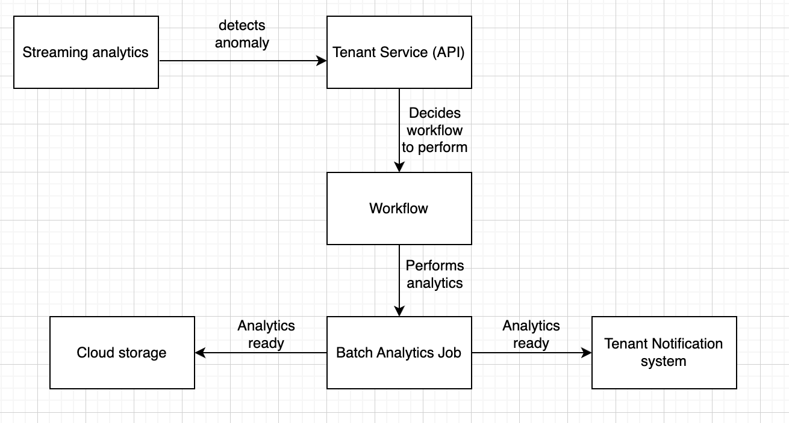

# Assignment 3 – Stream Analytics

## Part 1 – Design for Streaming Analytics

### 1. Dataset selection, scenario, and streaming analytics application (streamanalyticsapp)
For this assignment, as in the previous two assignments, I use the Reddit comments dataset. This dataset is perfectly
suitable because it naturally represents a stream of events, where each comment can be treated as an individual
event in a real-time system.

To emulate streaming behavior, I sort the dataset by the `created_utc` timestamp before the producer starts sending messages
to Kafka. This allows us to simulate near real-time ingestion in a realistic way. While this approach is not perfectly
identical to real-world streaming (since the data is pre-existing and read from a database), it still provides an 
accurate enough approximation of real-time event generation.

From an analytics perspective, the dataset is also very suitable. As described in Assignment 2, each comment contains
information about the subreddit, which enables grouping and aggregation. This allows performing streaming analytics such
as detecting spikes in subreddit activity, identifying trending topics, supporting marketing insights, or even acting as
an early signal for emerging news. These capabilities are particularly valuable in real-time scenarios where
immediate insights are required.

The scenario is designed as follows. A producer reads the dataset and sends each record as a message (event) to a
dedicated Kafka topic (stream-tenant-a). The streamanalyticsapp consumes these messages and processes them using a
tumbling window of 60 seconds based on event time (created_utc). To handle possible delays in processing or message
delivery, I introduce a watermark of 10 seconds, allowing late-arriving events to still be included in the correct
window. Events that arrive after this allowed delay are discarded.

When a window is closed, the application groups and aggregates the events within that window, for example by counting
the number of comments per subreddit to identify the most active subreddits during that time interval. The aggregated
results represent a summarized view of the streaming data.

//TODO fix this
After the window is finalized, the results are sent via a REST API to an analytics endpoint. The message includes the
window time range, tenant identifier, and aggregated metrics. The API layer validates the data and inserts it into
mysimbdp-coredms (CockroachDB), which acts as the data sink for storing streaming analytics results. This enables
further analysis, monitoring, and visualization of the processed data.

### 2. Messaging system design, data streams, and delivery guarantees
In this scenario, the streaming analytics should handle keyed data streams. Each event (comment) contains a subreddit
field, which is used as the key. This allows grouping events by subreddit and performing aggregations such as counting
the number of comments per subreddit within a time window. Using keyed streams ensures that all events related to the
same subreddit are processed together, which is necessary for correct analytics results. Otherwise, if for instance we
would not use keys, messages would be distributed between partitions and then not processed correctly by consumers. 
It also aligns well with Kafka’s partitioning model, where messages with the same key are routed to the same partition,
enabling scalable and ordered processing.

Using non-keyed streams would not be suitable in this case, since the analytics require grouping and aggregation.
Without a key, events would be processed independently, making it impossible to compute metrics such as subreddit
activity or detect trends.

Regarding message delivery guarantees, the most suitable choice for this scenario is at-least-once delivery. This
ensures that no data is lost, which is critical for analytics correctness. While this approach may introduce duplicate
messages, the impact is minimal in this use case, as small inaccuracies in aggregated counts are acceptable compared
to the risk of missing data. Exactly-once delivery would provide stronger guarantees but introduces additional
complexity, which is not necessary for this scenario. At-most-once delivery is not suitable, as it may result
in data loss and incorrect analytics results.

### 3. Time semantics, windowing, and out-of-order handling
The time range of the datasetis from the beginning of May 2015 to the end of May 2015. Each comment record contains
a `created_utc` field, which represents the timestamp of when the comment was created. As mentioned previously, these
timestamps are used as the event time and serve as the basis for assigning events to time windows in the streaming
analytics process.

For my test case, I use tumbling windows of 3 minutes. This choice is mainly influenced by the fact that I stream data
directly from a database rather than from a real-time source. In such a setup, there is a higher likelihood that events
may arrive slightly delayed relative to their original timestamps. By increasing the window size, I reduce the
probability of events falling outside their intended windows, which helps to avoid creating too many small windows
and reduces system complexity and resource usage. In a real-world system with properly distributed producers and lower
latency, smaller window sizes would be more appropriate.

The system uses event time (`created_utc`) as the primary time reference for processing. If the data source did not contain
timestamps, a possible solution would be to assign timestamps at ingestion time (processing time). However, this would
reduce accuracy, as the processing time does not reflect when the event actually occurred.

Out-of-order data records may occur in several situations. One possible cause is lack of key-based partitioning, where
events related to the same subreddit are distributed across multiple partitions and processed independently, potentially
breaking ordering guarantees. Another cause is limited processing capacity, where the stream processing application
cannot keep up with the incoming data rate. In such cases, events may be delayed and arrive after their corresponding
window has already been closed. Additionally, network latency or batching effects in the producer may also contribute
to delayed event delivery.

To handle such situations, watermarks are required. In this system, a watermark introduces a small delay (for example,
10 seconds) before a window is finalized, allowing late-arriving events to still be included in the correct window. This
is particularly important in my setup, where the dataset is large (around 30 GB) and streamed from a database, which may
introduce uneven ingestion rates.

While it is possible to design a more complex system that reprocesses late events or updates previous results (for
example, by issuing correction updates to the database), such approaches increase system complexity. In this implementation,
I assume that a small percentage of late or dropped events is acceptable. For example, processing approximately 95% of
the data correctly is sufficient for the purpose of real-time analytics, where slight inaccuracies are often acceptable
in exchange for lower latency and simpler system design.

### 4. Performance metrics for streamanalyticsapp
**Throughput** is the number of events processed per second. It can be measured by counting consumed Kafka messages over
time. It is important to ensure the system can keep up with incoming data.

**Processing latency** is the time between consuming a message and completing its processing. It can be measured using
timestamps in the stream application. This helps identify performance bottlenecks.

**End-to-end latency** is the time from when an event is created (created_utc) until the aggregated result is stored in
mysimbdp-coredms. It shows how quickly insights become available.

**Window processing delay** is the time between window end and when results are stored, including watermark delay. It
helps evaluate how timely the analytics results are.

**Dropped event rate** measures how many events are skipped (e.g., late events beyond watermark). It can be tracked via
logs. This is important for understanding data accuracy. (I do not introduce log tracer, so I assume in the real world
scenario this could be stored via logs)

### 5. Architecture design for streaming analytics
The tenant data source is based on a static Reddit dataset stored in SQLite. A producer service reads this data and 
sends it as a stream of events to Kafka. Kafka acts as the messaging system of mysimbdp, ensuring scalable and reliable
data ingestion. Messages are partitioned based on the subreddit key, enabling parallel processing.

The streamanalyticsapp is implemented using Quix Streams, which serves as the streaming framework/engine. It consumes
data from Kafka, processes it using event-time semantics and tumbling windows, and performs aggregations such as
counting comments per subreddit.

The results of the analytics are always ingested into mysimbdp-coredms, which is implemented using CockroachDB.
This ensures persistent storage and allows further querying and analysis of processed data.

Under certain conditions, the results could also be sent back to the tenant in near real-time. In this implementation,
this is simplified by storing results directly in the database, which the tenant can access. A more advanced system
could extend this by introducing a separate API layer like the one mentioned in part 3, but I will not provide it here.

From a reusability perspective, several components from previous assignments are reused. The mysimbdp-coredms
(CockroachDB) remains unchanged and continues to serve as the storage layer. The producer component is also reused
for streaming data generation. Additionally, the Kafka configuration from the previous assignment is reused as the
messaging system. The streamanalyticsapp itself is a new component, implemented using Quix Streams, which is
well-suited due to its native Kafka support.



## Part 2 – Implementation of Streaming Analytics

### 1. Implementation of streamanalyticsapp (schemas, serialization, processing logic, real-time output)
In my implementation, the streamanalyticsapp processes Reddit comments sent as JSON messages through Kafka. The input
data schema is defined in the producer the same way it was done in 2 previous assignments,
where each message contains fields such as subreddit and created_utc. In the stream
processing application, the data is simplified into a smaller schema containing only subreddit, created_utc, and a
counter (count = 1) to reduce complexity and focus on aggregation. (check `subreddit_window_stats` migration)

The output schema is defined in mysimbdp-coredms (CockroachDB), where results are stored in the subreddit_window_stats
table. Each record contains the tenant ID, subreddit, window start and end timestamps, and the aggregated comment count.

The input schema mostly matches the original row schema from the database, which makes the system more robust
and avoids additional transformations. For the output schema, I have chosen a simpler design. Instead of storing
each message individually, the system stores aggregated results, which reduces storage requirements, improves
read performance, and is sufficient for analytics purposes.

For serialization, JSON is used. The producer serializes messages using JSON.stringify, and the streamanalyticsapp
deserializes them using json.loads. JSON is chosen because it is simple and compatible across different languages
used in the system.

The processing logic is implemented using Quix Streams. Incoming messages are parsed and filtered to remove invalid records.
Event time is assigned using the created_utc field. The stream is grouped by subreddit (keyed stream), and a tumbling window
is applied like discussed above. Within each window, a reduce function aggregates the number of comments per subreddit.
The aggregation is stateful and maintained until the window is closed.

The results are produced when the window is finalized and then written to CockroachDB. This provides near real-time analytics,
where results are available after each window closes. The latency depends on the window size and allowed delay for late events.

### 2. Test environment and setup
I explained the environment sufficiently already in the part one, but to summarize,
since the dataset is static, streaming behavior is emulated by reading records from a SQLite database and sending
them to Kafka in timestamp order (created_utc). The producer sends messages in batches (batch size = 500), 
which simulates continuous data ingestion with controllable speed.

The mysimbdp platform in this setup consists of several components. Kafka is used as the messaging system, with a
single broker and a topic (stream-tenant-a) for tenant data. The streamanalyticsapp is implemented using Quix Streams
in Python and runs as a consumer with a defined consumer group. It processes messages using event-time semantics and
tumbling windows. CockroachDB is used as mysimbdp-coredms for storing analytics results, with tables for aggregated
results and monitoring metrics.

The components are connected as follows: the producer reads data from SQLite and sends it to Kafka, the
streamanalyticsapp consumes and processes the data, and the results are stored in CockroachDB. The system is
configured with parameters such as batch size (500), window size (5 seconds), Kafka broker address, and topic name.
These parameters can be adjusted to test different streaming conditions.

Overall, the test environment allows reproducible testing of the streaming analytics pipeline and enables evaluation
of system behavior under different data rates and configurations.

### 3. Execution results and performance evaluation
Here first of all I introduce briefly logs.
This is how adding instance to the window in streaming looks like:
```shell
stream-analytics  | 📊 SubredditDrama | 1 | 2015-05-01 03:01:15 - 2015-05-01 03:01:20
stream-analytics  | 📊 Art | 1 | 2015-05-01 03:01:10 - 2015-05-01 03:01:15
```
This is how the skipping window looks like (window is already closed):
```shell
stream-analytics  | [2026-04-04 09:54:11,117] [WARNING] [quixstreams] : Skipping window processing for the closed window timestamp_ms=1430443298000 window=(1430443295000, 1430443300000) late_by_ms=48716000 store_name=tumbling_window_5000_reduce partition=repartition__analytics-group--stream-tenant-a--subreddit[1] offset=161772
stream-analytics  | [2026-04-04 09:54:11,117] [WARNING] [quixstreams] : Skipping window processing for the closed window timestamp_ms=1430443307000 window=(1430443305000, 1430443310000) late_by_ms=48527000 store_name=tumbling_window_5000_reduce partition=repartition__analytics-group--stream-tenant-a--subreddit[1] offset=161773
```
During operation, the streamanalyticsapp parses incoming messages from the producer, groups them by subreddit, and
aggregates them within windows. For testing purposes, I use smaller window sizes (5 seconds) in order to observe system
behavior more frequently and get faster feedback. While such window sizes are not realistic for a production scenario,
they are useful for testing and evaluation.

The speed of the system is affected by the batch size used by the producer. With a batch size of 500, the
system processed approximately 75,446 comments during the first 5 minutes. It is important to note that a significantly
larger number of messages were actually sent, but many of them were skipped because they arrived too late relative to
their event time.

These tests were executed with a single instance of streamanalyticsapp. Since the Kafka topic is configured with 10
partitions, the available parallelism is not fully utilized in this setup. The effect of parallel execution is analyzed
in Part 5.

When varying the speed of streaming data, increasing the ingestion rate leads to higher throughput but also increases
the number of late events. This happens because the producer can send messages faster than the stream processing
application can aggregate and process them. As a result, more records fall outside their corresponding windows and
are skipped.

Regarding window function parameters, increasing the window size would reduce the number of skipped events and increase
the number of processed comments per window (but it will not propagate any different results). However, this would also increase the delay before results are produced.
In this test environment, since the data is artificially streamed from a static dataset, such changes do not fully
reflect real-world performance. Therefore, I focus more on analyzing the impact of parallelism in the following section.

### 4. Handling erroneous data records
First of all, there is no need to emulate erroneous data, because the dataset itself contains some malformed records, 
which allows testing the system's robustness without introducing artificial errors. For example, some records may have missing
fields, invalid timestamps, or incorrect data overall.

In this implementation, erroneous data is handled during parsing, filtering, and database operations. Each incoming
message is first processed by the parse function, where it is deserialized using json.loads. If the message is malformed
or cannot be parsed, an exception is caught and the function returns None. In such cases, a log message is printed,
but the application continues running without interruption.

After parsing, a filter is applied to remove invalid records. Messages that are None or do not contain a valid subreddit
field are discarded before further processing. This ensures that only valid data is passed to grouping and
aggregation stages.

For timestamp handling, if the created_utc field is missing, the system falls back to the default Kafka timestamp.
This allows the record to still be processed, although the accuracy of event-time processing is reduced.

During aggregation and database insertion, errors are handled using a try-except block in the handle_window function.
If a database error occurs, it is logged, and the system continues processing subsequent records.

Overall, erroneous data does not interrupt the streaming application. Invalid records are skipped early in the pipeline,
while valid data continues to be processed and stored correctly.

### 5. Parallelism, scalability, and performance analysis
Since key-based partitioning is used in the system, it is possible to utilize parallelism in streaming. More precisely,
since the stream is keyed by subreddit, messages with the same subreddit are routed to the same partition in Kafka.
This allows different partitions to be processed independently by multiple instances of the streamanalyticsapp,
enabling parallel processing.

The main factors affecting parallelism in this setup are the number of Kafka partitions, the number of streamanalyticsapp
instances (consumers), and the key distribution across partitions. The degree of parallelism is limited by the number
of partitions, since each partition can be consumed by only one instance within the same consumer group. Therefore,
increasing the number of instances without increasing partitions does not improve performance.

In the test environment, I evaluated performance with different numbers of instances. With a single streamanalyticsapp
instance, the system processed approximately 75,000 comments. When increasing to 5 instances, the system processed
around 311,323 comments, which is roughly 4 times higher throughput. This demonstrates that parallelism significantly
improves performance when multiple consumers process different partitions concurrently.

Further scaling was tested with 10 instances and 20 partitions. In this configuration, the system processed
approximately 416,948 comments, which is about 5.5 times higher than the single-instance setup. However, the performance
gain is not linear, as increasing the number of instances introduces additional overhead.

One observed issue is that a higher degree of parallelism leads to more late or outdated messages. This is partly due to
the producer sending messages in large batches, which is faster than the aggregation and window processing performed by
the streamanalyticsapp. As a result, some messages arrive too late and are skipped because their corresponding windows
are already closed.

Additionally, higher parallelism increases coordination overhead, such as Kafka partition assignment, state management,
and database writes. The database may also become a bottleneck when multiple instances attempt to write results
concurrently.

## Part 3 – Extension

### 1. Integration of external ML inference service
It would be quite easy to integrate it with the current implementation. When the window is closed, it currently
triggers an insert operation into the database, but this can be extended to also send the aggregated results to an
external RESTful service. This can be implemented as an additional step inside the handle_window function, where
instead of only writing to CockroachDB, the system sends a batch of processed records to the external service
using an HTTP request.

The external service would accept the aggregated data, perform ML inference (for example anomaly detection or trend
prediction), and return the results. These results could then be stored back into mysimbdp-coredms or forwarded to
the tenant for further use.

From the tenant perspective, they would need to define what kind of inference they require and provide the endpoint
of the external service. The tenant could configure the streamanalyticsapp to send specific aggregated data to this
service. This means that the tenant is responsible for ensuring that the input schema of the analytics results
matches the expected input of the ML service.

Overall, the integration introduces an additional processing step after window aggregation, where the
streamanalyticsapp acts as a bridge between the streaming pipeline and the external ML service.

### 2. Handling and storing erroneous records for further inspection
For that, I would first introduce a new table in the database, for example `stream_analytics_errors`, which would store
erroneous records. This table would contain fields such as the source of the record, timestamp, error message, batch
identifier, and possibly additional metadata. This allows all invalid or unprocessable records to be persisted
instead of being discarded.

In the streamanalyticsapp, error handling would be integrated into the parsing and validation stages. When a record
fails to be parsed or is missing required fields (such as `subreddit` or `created_utc`), instead of simply filtering it
out, the application would capture the original message along with the reason for failure. This information would
then be written into the stream_analytics_errors table.

Additionally, since Quix Streams maintains state through tumbling windows, it is possible to correlate erroneous
records with specific windows or time intervals. This makes debugging easier, as one can trace when and under which
conditions errors occurred.

To extend this further, an API layer could be introduced that provides access to both valid aggregated results and
stored erroneous records. This would allow another application or service to inspect, analyze, or even reprocess
failed records if needed.

### 3. Workflow orchestration for triggering batch analytics and notifications
In this scenario, a tenant service receives streaming analytics results and detects a critical condition, such as a
sudden spike in activity. When a critical condition is detected, the tenant service triggers a workflow using a 
workflow engine (for example, Apache Airflow or a similar orchestration tool). The workflow consists of several
steps executed in sequence.

Before going to the workflow itself, I find it important to distinguish a separate layer in the form of a tenant-defined
API service that decides the workflow execution. This allows adding more flexibility and enables handling critical
conditions in a more specific and controlled way.

First, the workflow starts a batch analytics job that queries historical data stored in mysimbdp-coredms (CockroachDB).
This job performs deeper analysis, such as identifying long-term trends or anomalies that cannot be detected in real-time
streaming.

After the batch analytics job is completed, the results are stored in a cloud storage service (for example, an object
storage bucket). This allows the results to be accessed later and shared across different services.

In parallel, the workflow triggers a notification step. A notification service sends a message to the tenant user, for
example via email or a messaging system, informing them that the batch analytics results are available in cloud storage.



### 4. Schema evolution handling and detection
In my opinion, the best practice would be to have a specific set of parameters that the tenant can provide via a JSON
configuration. This configuration would define validation rules, required fields, and data types. The configuration can
be stored either in a database or in a cloud storage bucket, which is more scalable. The streamanalyticsapp can then
load the configuration dynamically based on the tenant ID and keep it in memory during runtime.

For validation, a flexible function can be implemented that transforms the JSON configuration into validation rules,
similar to schema validation libraries such as Zod.

To ensure that the running streamanalyticsapp does not process data with a wrong schema, strict validation is applied
before processing. If incoming data does not match the expected schema, it is rejected or redirected for further inspection.

To detect schema changes, schema versioning can be introduced. Each schema configuration would include a version
identifier. When new data arrives, its schema version can be compared with the expected version. If a mismatch is detected,
the system can log an error or notify the developer. Additionally, validation failures themselves can act as an indicator
of schema changes, signaling that incoming data no longer matches the expected format.

### 5. End-to-end exactly-once delivery
In the current implementation, it is not possible to guarantee end-to-end exactly-once delivery. The system is 
configured with at-least-once processing semantics, which means that messages may be processed more than once in
case of failures or restarts.

The main limitation comes from the interaction between Kafka, the stream processing application, and the database.
While Kafka and stream processing frameworks can support exactly-once processing under certain configurations, the
database writes in this implementation are not idempotent. Each window result is inserted into CockroachDB without
checking for duplicates, so if a failure occurs after processing but before committing offsets, the same data may
be written again.

To achieve end-to-end exactly-once delivery, several changes would be required. First, idempotent writes or upsert
operations should be used in the database, ensuring that duplicate results do not create inconsistent data. Second,
transactional guarantees should be enabled in the streaming framework and Kafka, so that message consumption and
result production are coordinated atomically. Additionally, proper checkpointing and state management must be ensured
so that the system can recover without reprocessing already committed data.